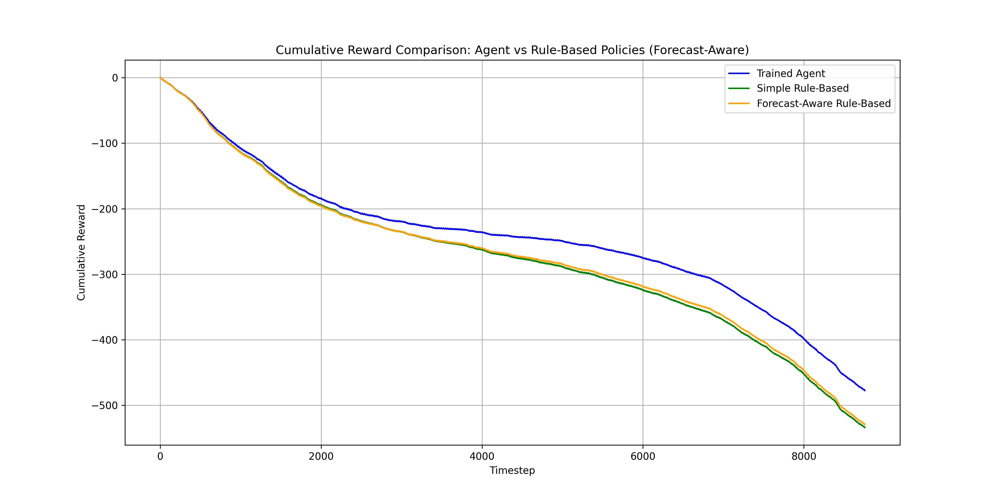

# Solar Battery Reinforcement Learning Agent

## Overview

Imagine you’ve just installed solar panels and a home battery. You want to **use as much of your solar energy as possible**, reduce your reliance on the grid, and ideally **save money** by storing energy when it’s cheap and selling it back when prices are high. But deciding **when to charge, discharge, buy, or sell electricity** is tricky — energy patterns are complex, prices fluctuate, and your consumption changes hour by hour.

This project explores how a **reinforcement learning (RL) agent** can take over these decisions. Using historical data, forecasts, and environmental variables, the agent learns the best way to manage a household battery to **maximize self-consumption and minimize energy costs** — outperforming traditional rule-based strategies.

The graph above shows cumulative rewards over a test year (2023), comparing:  
- **Trained SAC Agent**  
- **Simple Rule-Based Policy**  
- **Forecast-Aware / Context-Aware Rule-Based Policy**  

Even with more sophisticated rule-based logic and access to forecasts, the RL agent consistently achieves higher rewards. It learns subtle patterns in energy usage, solar production, and price fluctuations — patterns that are difficult to capture with fixed rules.

---

## How It Works

The environment simulates a **household with solar panels and a battery**, where every timestep represents one hour. It provides:

- Current **PV production** and **household consumption**  
- **Battery state of charge (SOC)**  
- Environmental data: `temperature`, `pressure`, `solar irradiance`, `wind speed`  
- Energy prices (`buy_price`, `sell_price`)  
- **Forecasts** for PV production and load for up to 12 hours ahead  

At each timestep, the agent decides:  
- How much PV energy to **consume immediately**  
- How much to **store in the battery**  
- How much to **discharge to the house**  
- Whether to **buy or sell electricity**  

The **reward function** encourages self-consumption, selling at profitable times, and minimizing grid purchases. Over time, the agent learns the optimal strategy that balances all these factors.

---

## Rule-Based Policies for Comparison

We implemented two rule-based strategies:

1. **Simple Rule-Based Policy**  
   - Self-consumes PV first  
   - Charges the battery if there’s excess PV  
   - Discharges battery when PV is insufficient  
   - Falls back to the grid when needed  

2. **Forecast-Aware / Context-Aware Rule-Based Policy**  
   - Uses up to **12-hour forecasts** of PV and load  
   - Adjusts battery reserves based on time of day and expected PV  
   - Considers energy prices for buying and selling  

Even though the forecast-aware policy is more sophisticated, it **cannot fully match the agent**. The RL agent learns non-linear, context-dependent strategies that a fixed set of rules cannot replicate.

---

## Training the Agent

- **Algorithm:** Soft Actor-Critic (SAC), a state-of-the-art off-policy RL method  
- **Training data:** 2015–2022 (~6 years)  
- **Testing data:** 2023 (1 year)  
- Observations include environmental variables, PV production, load, forecasts, and prices  
- The agent learns to maximize **cumulative reward**, considering both immediate and future outcomes  

---

## Why It Matters

For a homeowner, this means:  

- **Saving money** by using solar energy efficiently and selling excess at the right time  
- **Reducing grid dependency** while maintaining comfort  
- **Automating battery management** without manually checking consumption or production  
- Seeing, in practice, how a reinforcement learning agent can **outperform even smart rule-based strategies** in energy optimization  

This project demonstrates how data-driven control can make household solar and battery systems **smarter, more efficient, and cost-effective**.

---

## Files

- `gym_env.py` — Simulates PV-battery environment  
- `solar_batt_agent_full.zip` — Trained SAC agent  
- `test.csv` — Test dataset (2023)  
- `outputs/cumulative_rewards_comparison.png` — Graph comparing agent and rule-based policies  

---

## Next Steps

- Expand to **multi-household simulations** for neighborhood-level energy optimization  
- Integrate **dynamic electricity tariffs** in real time  
- Deploy as a **home automation system** for battery management  
